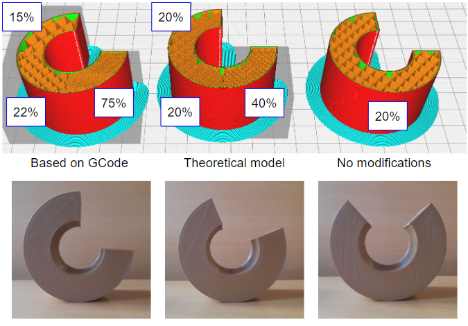

Blender add-on for visualizing the center of mass of 3D prints (.gcode files).

## Features

- Easily analyze balance and weight distribution of 3D prints.
- Precise calculation from individual strokes of 3D printer.
- Intuitive integration into Blender's user interface.

## Installation

1. Download printcom addon as .zip file.
2. Open Blender and go to Preferences > Add-ons.
3. Click on "Install" and select the downloaded ZIP file.
4. Enable the "[printcom] 3D prints CoM visualization" addon.
5. The addon's panel will now be available in the sidebar.

## Usage

1. __Select__ path to your model (__.stl file__).
2. __If__ your __print__ is __not__ planced __in the center of the bed__, use offset properties to __move the model__ so it's bed position in blender matches position in your slicing software.
3. __Click "Spwan .stl"__ to import your model.
4. __Select__ path to __.gcode file__ (sliced model).
5. __Enter size of printer__ (head max. coords) G-code was produced for.
6. __Click__ on the __"Calculate"__ button.

The __center of mass__ will be __displayed__ in the viewport __by 3D cursor__ (e.g. like in banner at the top)

## Notes

- printer size (x,y mnax. coord) needed for conversion to blender's coordinate system, entering incorect values will affect results.
- if your model is not in .stl format simply import it through blender and place into frame (scene) yourself.

## Results

  
## License

This addon is released under the [MIT License](./LICENSE).

----

**Note**: This addon is currently in active development. Feedback and contributions are welcome!
